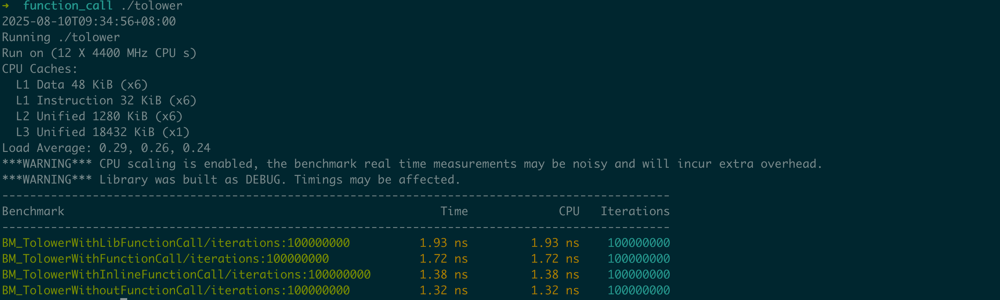

# function_call

本目录主要用于度量不同函数调用实现的性能损耗：分别以不同方式实现tolower()函数，通过10000万次迭代基准测试，统计对比结果。该项目可以帮助您了解：

1. **函数调用开销**: 比较有无函数调用的性能差异
2. **内联优化效果**: 验证编译器内联优化的实际效果
3. **标准库性能**: 了解标准库函数与自定义实现的性能对比

## 目录结构

- `tolower.cpp`       —— 源码，实现字符串转小写及性能测试
- `tolower`           —— 可执行文件，由源码编译生成
- `Makefile`          —— 构建脚本，便于编译和清理
- `README.md`         —— 说明文档

## 依赖

- g++ (建议 7.0 及以上，支持 C++11 标准)
- Google Benchmark（libbenchmark-dev，需系统已安装）
- pthread（通常随系统提供）

如需安装 Google Benchmark（以 Ubuntu 为例）：

```bash
sudo apt-get install libbenchmark-dev
```

## 构建

在本目录下，执行：

```bash
make
```

将会编译生成 `tolower` 可执行文件。


## 运行

编译完成后，直接运行：

```bash
./tolower
```

程序将执行不同函数调用实现方式的性能基准测试，并输出相关测试结果，示例：



## 博文

- [时延揭密：探索不同函数调用实现背后的性能差异](https://mp.weixin.qq.com/s/-A76znRn4E35IywYPjirCA)